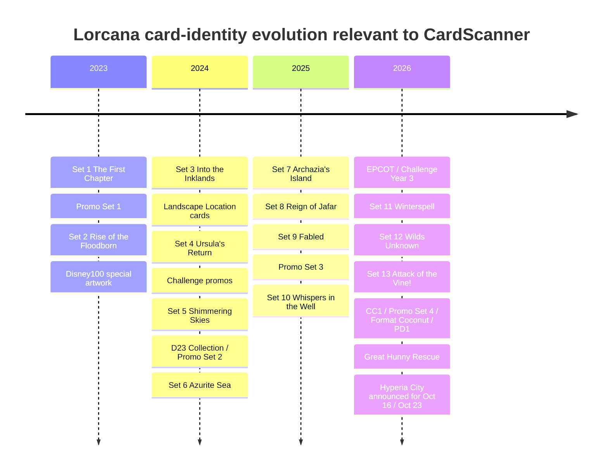
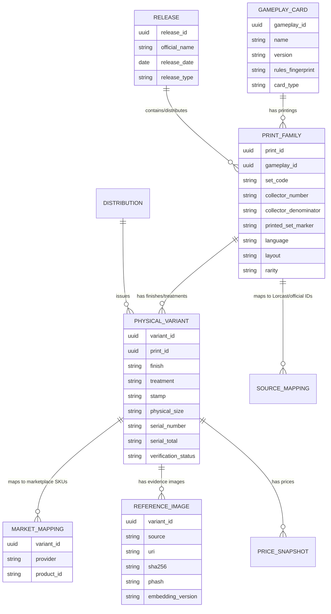
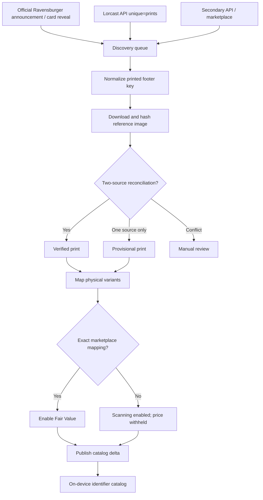

# Disney Lorcana Data, Variant, and Scanner-Architecture Audit

> **Imported research snapshot — 2026-10-03.** This report was supplied by the
> repository owner and has not been independently revalidated against the
> current app or external sources. Citation identifiers from the originating
> research session are preserved but are not portable links; see the prioritized
> source list at the end as starting points for verification. This is design
> research, not evidence of implemented Lorcana support or release readiness.

**Implementation recalibration — 2026-10-04:** the current shared game-adapter
structure and first-slice scope are documented in the [Lorcana implementation
plan](../plans/lorcana_code_implementation.md). Its execution sequence supersedes
the broad six-stage implementation proposal below; this imported research remains
background and does not establish current catalog or release coverage.

## Executive summary

**Verdict: Lorcana is an excellent candidate for CardScanner's identifier-first architecture, but the identity model should be slightly different from One Piece.**

For One Piece, the printed `OP01-016`-style number is fundamentally a **game-card identity** that survives many reprints and alternate treatments. Lorcana instead prints a **collector number, language marker, and set identifier in a highly regular footer**, and a later reprint can receive a new set/collector identity. Lorcast explicitly models duplicate gameplay cards versus distinct prints, including an example where *Distract* exists as Into the Inklands #159 and again as Winterspell #164. citeturn5view2turn3search1turn8view1

That makes the ideal Lorcana pipeline:

> **OCR printed set + collector number + language → identify the physical print family → resolve foil/stamp/physical-format ambiguities visually.**

In several respects this is **better than One Piece**. Enchanted cards, for example, normally receive their own collector numbers above the ordinary set range. Lorcast's documented Elsa — Spirit of Winter Enchanted is `207` in The First Chapter, so its premium artwork is not merely another image hanging off the same `042`-type base identifier—the footer itself distinguishes the Enchanted print. citeturn5view2 The newer premium-rarity system likewise gives us substantially more printed identity information than a treatment-only model; official 2026 Lorcana material explicitly identifies Iconic and Enchanted cards among the game's rarest card types. citeturn27search13turn29search16

The **main unresolved exact-variant problem is ordinary foil versus non-foil**. Lorcast carries separate `usd` and `usd_foil` pricing on one print record, which is exactly what we would expect when the collector footer itself does not distinguish those two finishes. citeturn5view2 Event stamps and a few special promotional treatments can create a similar problem. Those require image/stamp/reflectivity detection after OCR.

The data side is also strong. **Lorcast is presently the closest equivalent to Scryfall for Lorcana.** It offers a documented REST-like API; standard and promotional set objects; card/set/collector lookup; distinction between unique gameplay cards and all physical prints; TCGplayer IDs; prices; and multiple image resolutions. Lorcast itself describes the service as a programmatic card-data API, while its original announcement explicitly described it as a “Scryfall-like” Lorcana service. citeturn24search6turn24search18turn24search26

However, **Lorcast should not be our sole catalog authority**. Its current `/sets` response contains the fourteen numbered expansions plus many promos, but it omits some unquestionably official special products/classes—notably older Illumineer's Quest products as independent sets, while Q3 *Hunny Rescue* is present. Ravensburger's own current product navigation lists *Deep Trouble*, *Palace Heist*, and *The Great Hunny Rescue*. citeturn23view1turn29search1 There are analogous wrinkles around Disney100 and fixed-product reprints. We therefore need our own reconciled printing database rather than mirroring any vendor's set list.

As of **October 3, 2026**, the latest released numbered booster expansion is **Set 13, Attack of the Vine!**, released July 17, 2026 in Lorcast's catalog. *Illumineer's Quest: The Great Hunny Rescue* is a newer card-bearing special release dated October 2. Set 14, **Hyperia City**, is still future: Ravensburger lists prerelease on October 16 and general availability on October 23, 2026. citeturn23view1turn27search1 I therefore audit Hyperia as an **announced/provisional set**, not as an already released set.

My overall engineering assessment is:

| Question | Assessment |
|---|---|
| Consistent OCRable footer on normal cards | **Excellent** |
| Footer identifies numbered booster printing | **Excellent** |
| Chase cards distinguishable from footer | **Usually excellent** |
| Foil vs non-foil from footer | **No — visual treatment detection required** |
| Promo identity | **Good, but needs reconciliation** |
| Reprints | **Very manageable; new print IDs are common** |
| Landscape/Location cards | **Separate orientation ROI, not a blocker** |
| Oversized cards | **Footer alone may be insufficient** |
| Quest/scenario cards | **Separate special-card subsystem advisable** |
| API/card data | **Strong** |
| Variant-specific images | **Strong** |
| Current market mapping | **Strong via Lorcast → TCGplayer** |
| One-source exhaustive catalog | **No** |
| Multi-source production catalog | **Yes** |
| Overall CardScanner suitability | **~9/10** |

The most important conceptual difference from One Piece is therefore:

```text
ONE PIECE
printed number
    ↓
canonical gameplay card
    ↓
many physical variants


LORCANA
printed collector + set + language
    ↓
physical print family
    ↓
usually 1–2 finish/stamp variants
```

That difference actually **reduces the visual-classification burden** for many expensive Lorcana cards.

## Identifier system, footer consistency, and the complete set audit

### What is actually printed on the card

Lorcana does **not** have a Bandai-style global identifier such as `OP05-119`.

Instead, normal Lorcana cards carry a compact collector footer that supplies enough information to construct a stable print key. Lorcast's data model exposes the same pieces separately: `collector_number`, language, and set; collector number is deliberately represented as a string rather than assuming every identifier is a simple integer. It supports direct lookup by set and collector number. citeturn5view1turn5view2turn4view2

For normal numbered expansion cards, the visually useful portion is conceptually:

```text
207/204    EN    1
│          │     │
│          │     └─ set / release marker
│          └─────── language
└────────────────── collector number / normal set denominator
```

The exact graphical separators and set treatment vary, so production OCR should **recognize the components rather than require an exact typography string**.

For example, Lorcast identifies the famous Enchanted Elsa — Spirit of Winter as The First Chapter collector number `207`; the fact that 207 exceeds the ordinary 204-card sequence is intentional rather than an error. citeturn5view2 TCGplayer similarly exposes cards by printed collector fractions—for example Shimmering Skies Belle — Of the Ball as `#158/204` and Reign of Jafar Rolly — Chubby Puppy as `#26/204`. citeturn26search0turn26search11

This is **very OCR-friendly**:

- almost all primary identity information is digits;
- `/` is a high-information delimiter;
- the language code is tightly constrained;
- set identity is tightly constrained;
- the parsed result can immediately be validated against our local catalog.

Critically, we should **not hard-code `/204`**. Attack of the Vine marketplace cataloging already contains ordinary cards with a `/207` denominator, demonstrating that newer sets need data-driven denominators. citeturn2search8

The footer therefore provides something extremely close to a machine-readable key, despite not being formally encoded as a barcode or QR code.

### Set-by-set numbered-expansion reconciliation

Dates below use Lorcast's current machine-readable set catalog, cross-checked where current official product material was available. The Lorcast `/sets` feed spans Promo Set 1 and Set 1 in August 2023 through Set 14 in October 2026 and also identifies numerous promotional/special releases. citeturn23view1 Hyperia's status is separately confirmed by Ravensburger: October 16 prerelease, October 23 general availability. citeturn27search1

| Set | Release date | Identifier/footer behavior | Major variant/treatment considerations | Scanner/data gaps |
|---|---:|---|---|---|
| **The First Chapter — Set 1** | Aug. 18, 2023 | Standard collector fraction + `EN` + Set 1 marker; highly consistent | Base nonfoil/foil; Enchanted cards use their **own collector numbers above the base sequence**; launch promos exist separately | Gift products included **oversized foil cards**, which should not be conflated with normal-size playable cards. Ravensburger confirms both oversized and playable foil cards in early gift products. citeturn2search17turn5view2 |
| **Rise of the Floodborn — Set 2** | Nov. 17, 2023 | Same basic footer architecture | Nonfoil/foil + Enchanted; Disney100 Edition introduced six specially illustrated cards drawn by Walt Disney Animation Studios animators | Disney100 is a physical-printing layer that cannot safely be inferred from ordinary Set-2 enumeration alone. citeturn14search19turn23view1 |
| **Into the Inklands — Set 3** | Feb. 23, 2024 | Same collector footer, but **Location cards add a landscape layout** | Base foil/nonfoil; Enchanted; special gift products | Landscape cards require rotation/layout detection before applying the normal lower-footer OCR ROI. Into the Inklands gift sets again include oversized foil cards. citeturn2search11turn2search31turn5view2 |
| **Ursula's Return — Set 4** | May 17, 2024 | Same format | Base/foil + Enchanted; Challenge promotional program becomes important | Competitive promos can use their own promo identity and extended artwork/stamps; Ravensburger specifically documented an extended-art Dragon Fire Challenge promo. citeturn14search28turn23view1 |
| **Shimmering Skies — Set 5** | Aug. 9, 2024 | Same footer family; ordinary cards still visibly use `/204` | Foils, Enchanted, D23 special collection, Promo Set 2 | D23 must be a separate distribution/printing class. Standard Set-5 footer itself remains simple. citeturn26search0turn23view1 |
| **Azurite Sea — Set 6** | Nov. 15, 2024 | Same footer | Standard/foil/Enchanted plus collector-gift-product variants | Gift-box exclusive art needs product-level reconciliation rather than assuming all variants are booster pulls. Official Azurite Sea material confirms its November hobby release. citeturn14search22turn23view1 |
| **Archazia's Island — Set 7** | Mar. 7, 2025 | Same architecture | Base/foil/Enchanted; normal numbered expansion | No architectural break found. Main risk remains completeness of special product/promotional printings around the set. citeturn23view1 |
| **Reign of Jafar — Set 8** | May 30, 2025 | Same architecture; marketplace examples still use `/204` | Base/foil/Enchanted | *Illumineer's Quest: Palace Heist* is a distinct official card-bearing product that should not be assumed to be fully represented by the main-set catalog. citeturn26search11turn29search1 |
| **Fabled — Set 9** | Aug. 29, 2025 | Footer architecture continues | Expanded premium-rarity era; reprint management becomes increasingly important | API rarity enums must not be frozen to launch-era rarities. Lorcast's documented enum is older than the present game's rarity vocabulary, while Ravensburger now officially discusses Iconic cards. citeturn5view2turn27search13 |
| **Whispers in the Well — Set 10** | Nov. 7, 2025 | Same pattern | Base/foil plus modern chase classes | No footer break found; schema must remain treatment-extensible. citeturn23view1 |
| **Winterspell — Set 11** | Feb. 13, 2026 | Same pattern | Modern chase classes; **confirmed cross-set gameplay reprints** | Lorcast directly shows *Distract* as Into the Inklands #159 and Winterspell #164, proving one gameplay card can have two footer identities. citeturn8view1 |
| **Wilds Unknown — Set 12** | May 8, 2026 | Same pattern | Current premium-rarity model | No fundamental identifier change found. Ravensburger maintains an official product page and Lorcast a current set entry. citeturn2search20turn23view1 |
| **Attack of the Vine! — Set 13** | Jul. 17, 2026 | Same footer concept, but **do not assume denominator 204** | Iconic and Enchanted explicitly highlighted by Ravensburger; CC1/P4/event products overlap this release period | TCGplayer evidence shows `/207`, so denominator must be catalog-driven. citeturn20search2turn2search8turn23view1 |
| **Hyperia City — Set 14** | Prerelease Oct. 16; everywhere Oct. 23, 2026 | Expected continuation, but still unreleased on Oct. 3 | Final chase/print universe still provisional | **Do not mark catalog complete yet.** Ravensburger's release dates place this in the future relative to today's audit. citeturn27search1turn29search16 |

Nothing in the thirteen released numbered expansions shows a collapse of the footer strategy. The major layout change—**Location cards**—changes orientation rather than eliminating identity information. Lorcast even has an explicit `layout` field that distinguishes normal and landscape card layouts, which gives our ingest and scanner code a machine-readable way to prepare separate ROIs. citeturn5view2

### Why Enchanted/Epic/Iconic are unusually scanner-friendly

This is a significant advantage over One Piece.

In One Piece, a Manga Rare may retain the same `OPxx-###` footer as a base or parallel card. Lorcana chase printings frequently live **outside the base collector sequence**, so the collector number itself identifies that premium art.

The Lorcast API documentation uses **Elsa — Spirit of Winter, The First Chapter #207** as a lookup example and labels it Enchanted. citeturn5view2 That means:

```text
OCR: 207/204 … 1
        ↓
Set 1 / collector 207
        ↓
Elsa — Spirit of Winter, Enchanted
```

There is no need first to resolve “base Elsa versus Enchanted Elsa” from artwork.

The same basic concept should be retained for the post-Fabled premium-rarity system rather than flattening every special art into a treatment field. Ravensburger's 2026 material explicitly talks about Iconic and Enchanted as distinct rare card types, so our rarity enum needs to be source-driven and extensible. citeturn27search13turn29search16

**Where OCR does not finish the job is finish-level differentiation**, especially foil versus nonfoil. Lorcast's data structure assigns one card/print both a normal price and a foil price, which is strong evidence that finish belongs below print identity in our schema. citeturn5view2

### Timeline



The chronological set/product records in that diagram are reflected in Lorcast's current `/sets` response; Ravensburger independently confirms current 2026 products and Hyperia's upcoming dates. citeturn23view1turn29search1turn27search1

## Data sources, promo universe, and reconciliation audit

### Source hierarchy

The data ecosystem is good enough to build this without hand-entering the entire game, but **no single source passes the “everything forever” test**.

| Source | What it is good for | Weakness / production role |
|---|---|---|
| **Ravensburger / Disney Lorcana official site + Companion App** | Official existence of products/cards, release announcements, rules, errata, promo announcements | I found no documented general-purpose official REST/JSON API comparable to Scryfall. Use as **authority/reconciliation evidence**, not runtime dependency. The official site explicitly directs collectors to the Companion App for collection/card information. citeturn27search26turn14search8 |
| **Lorcast** | Best public structured catalog: sets, collector numbers, gameplay data, print distinction, images, TCGplayer IDs, prices | Community project, API v0; special-release enumeration is not perfectly synonymous with every official physical product. **Primary ingestion source, but reconcile it.** citeturn24search6turn24search18 |
| **Lorcana-api.com** | Free/open-source API, self-hostable; card images and variation support | Useful independent cross-check/fallback, but I would audit freshness before making it authoritative. Its changelog says it added multiple image sizes and all then-current variations. citeturn29search2turn29search8 |
| **TCGplayer** | Commercial SKU IDs and US raw-market evidence; foil/nonfoil pricing | Marketplace taxonomy, not card rules authority. Lorcast conveniently exposes `tcgplayer_id`. citeturn5view2turn25search6 |
| **eBay / sold-market aggregators** | Evidence for obscure promos, unusual physical variants, signed aftermarket cards, graded sales | Extremely noisy identity source; never create a canonical variant from one seller title. PriceCharting, for example, explicitly says its Lorcana data incorporates eBay/marketplace sales. citeturn26search7 |
| **Scryfall** | Architecture inspiration | It is not the Lorcana database; Lorcast is explicitly positioned as a Scryfall-like Lorcana service. citeturn24search26 |
| **Limitless / Scrydex** | Potential secondary sources if they expose Lorcana in future | I did **not** find a sufficiently documented current Lorcana card/variant API from either during this audit to put them in the production dependency chain. |

Lorcast also gives us a particularly valuable concept that should survive into our database: `unique=cards` versus `unique=prints`. The former can collapse the same gameplay object; the latter preserves separate printings. Lorcast added this specifically so duplicate prints are available instead of silently deduplicated. citeturn3search1

That is exactly the distinction CardScanner needs.

### Promo and special-product inventory

Lorcast's live October 2026 set feed contains the following non-numbered catalog families in addition to Sets 1–14:

`P1`, `cp`, `D23`, `P2`, `P3`, `DIS`, `C2`, `CC1`, `P4`, `Coconut`, `PD1`, and `Q3`. citeturn23view1

Those map to categories such as general promo waves, Challenge cards, D23, EPCOT Festival of the Arts, Challenge Year 3, Curator's Collection, Format Coconut, and Great Hunny Rescue. This is excellent coverage of unusual material—but also evidence that **“set” means broader than booster expansion** in the source schema. citeturn23view1

There are nevertheless official products outside that enumeration. Ravensburger's current product navigation includes all three Illumineer's Quest products—*Deep Trouble*, *Palace Heist*, and *The Great Hunny Rescue*—yet Lorcast's current set feed exposes only `Q3` as an independently enumerated Quest set. It also lists Gateway and various gift/starter products on the official side without corresponding one-to-one Lorcast “sets.” citeturn29search1turn23view1

That is not necessarily a Lorcast error: many fixed products reuse cards whose identities belong to prior sets. It **is**, however, proof that we cannot discover the complete physical SKU universe merely by iterating `/sets`.

### Treatment-class audit

| Class | Does footer resolve it? | Required scanner behavior |
|---|---|---|
| **Normal numbered card** | Yes, effectively | OCR print key; no global image search |
| **Standard foil vs nonfoil** | **No** when same print ID/art | Multi-frame reflectivity/foil classifier |
| **Enchanted** | Usually **yes**, via distinct collector number | OCR often sufficient |
| **Epic / Iconic-era chase cards** | Usually modeled as distinct collector entries | Parse as print identity; leave rarity enum extensible |
| **Promo-numbered cards** | Usually very good | Parse alphanumeric promo denominator/set token; validate catalog |
| **Alternate-art promotional cards** | Often distinct promo/collector identity | OCR first; artwork/stamp second when necessary |
| **Tournament/Challenge stamp** | Sometimes shared underlying art/ID | Localized stamp detector after OCR |
| **Disney100 / D23 special artwork** | Special-release metadata needed | Reconcile product code + image; do not infer from character/name |
| **Printed/facsimile signatures** | Not a reliable independent ID | Store as treatment/art element if official |
| **Personally hand-signed card** | No official print identity | User annotation `autographed`, not a separate canonical card unless Ravensburger issued it that way |
| **Serialized/numbered card** | No established released Lorcana class found in this audit | Reserve schema fields, but do not invent current variants |
| **Oversized collectible card** | Potentially **no** if enlarged copy has same visible identity | Physical-size/context classification or user confirmation |
| **Location card** | Yes after orientation correction | Landscape pipeline |
| **Quest/boss/scenario card** | Not guaranteed | Separate special-card catalog/layout classifiers |
| **Tokens/counters** | Typically no normal collector footer | Object-class path, not standard card OCR |
| **Playmat** | Not a card | Reject/object-classify |

On serialized cards specifically: I found **no authoritative Ravensburger evidence that a numbered-serialization system comparable to Magic serialized cards is part of the released Lorcana card catalog through October 3, 2026**. Ravensburger did announce future **Collector Boosters** on August 15, 2026, which means our schema should reserve `serial_number`, `serial_total`, and new treatment fields rather than assume today's treatment universe is permanent. citeturn29search16

Likewise, a signed card on eBay should **not** automatically become an official “signed variant.” Marketplace autographs need provenance and should initially be a user-collection annotation. TCGplayer/eBay are valuable as market evidence, not as sufficient evidence that Ravensburger intentionally manufactured a separate printing.

### Edge-case reconciliation

The following are the cases I would use as our seed regression set because each exposes a different failure mode.

| Test case | Source A | Source B | Reconciliation result |
|---|---|---|---|
| **Elsa — Spirit of Winter, Enchanted, TFC #207** | Lorcast's API documentation explicitly uses Set 1 collector `207` and supplies a TCGplayer ID/foil pricing structure. citeturn5view2 | Ravensburger's official collector positioning recognizes Enchanted as a distinct collectible chase class. citeturn27search26 | **PASS.** Premium version is separately number-addressable; footer-first works unusually well. |
| **Shimmering Skies Belle — Of the Ball #158/204** | TCGplayer displays `#158/204`. citeturn26search0 | Lorcast identifies Shimmering Skies as Set 5 in its authoritative API set object. citeturn23view1 | **PASS.** `(158/204, set 5, language)` is an excellent OCR key. |
| **Reign of Jafar Rolly #26/204** | TCGplayer explicitly exposes `#26/204`. citeturn26search11 | Lorcast independently identifies Reign of Jafar as Set 8. citeturn23view1 | **PASS.** Same footer structure survived to Set 8. |
| **Attack of the Vine ordinary card #165/207** | TCGplayer exposes `/207`. citeturn2search8 | Ravensburger confirms Attack of the Vine as the current 2026 set and its current premium-card program. citeturn27search13 | **PASS with parser change.** Never hardcode 204. |
| **Distract, Into the Inklands #159 → Winterspell #164** | Lorcast's print page explicitly associates the card with both prints. citeturn8view1 | Lorcast's documented duplicate-print behavior distinguishes `unique=cards` from `unique=prints`. citeturn3search1 | **PASS, architectural warning.** Gameplay entity ≠ physical print ID. |
| **Disney100 alternate artwork** | Ravensburger says the Disney100 Edition contains six TFC/Floodborn cards with new animator artwork. citeturn14search19 | Lorcast's architecture supports promotional releases and separate print records rather than forcing them to overwrite base cards. citeturn24search18turn3search1 | **PASS, but requires special-product reconciliation.** |
| **Challenge Dragon Fire extended-art promo** | Ravensburger specifically identifies Dragon Fire as an extended-art Challenge promo. citeturn14search28 | Lorcast independently contains a `cp` Challenge Promo release family dated May 17, 2024. citeturn23view1 | **PASS.** Competitive promo layer is data-modelable. |
| **Oversized foil gift-set cards** | The First Chapter official product material says gift sets contain oversized foil cards in addition to playable foil cards. citeturn2search17 | Into the Inklands official product material independently documents oversized foil cards again. citeturn2search11turn2search31 | **FOOTER EXCEPTION.** Same-looking card at different physical scale may be impossible to identify from a tightly cropped photo alone. |
| **Illumineer's Quest products** | Ravensburger currently lists Deep Trouble, Palace Heist and Great Hunny Rescue as official products. citeturn29search1 | Lorcast `/sets` currently exposes `Q3` Great Hunny Rescue but not Q1/Q2 as separate set records. citeturn23view1 | **SOURCE-GAP FOUND.** Quest/scenario cards need explicit product ingestion, not set enumeration alone. |
| **Foil/nonfoil same numbered print** | Lorcast card objects have separate regular and foil price fields. citeturn5view2 | TCGplayer's Lorcana catalogs commercially distinguish market versions/finishes. citeturn25search6 | **VISUAL DISAMBIGUATION REQUIRED.** Never auto-copy the nonfoil price to foil or vice versa. |

That reconciliation is enough for me to say the architecture is not merely theoretically viable. The edge cases line up with clean, explicit database layers.

### Regional and language behavior

Language needs to be part of physical identity, not merely display metadata. Lorcast has a `lang` field on card records, while the physical footer itself supplies a short language marker such as English `EN`; that provides another strong OCR checksum. citeturn5view2

For the first CardScanner release I would deliberately define the supported universe as **English printings**, because the Lorcast→TCGplayer price/mapping path is strongest there. Non-English and region-exclusive products should be ingested language-by-language and source-by-source rather than assuming that an English card image and a translated card with the same number are interchangeable.

This matters particularly for promotional distributions. Ravensburger's 2026 news, for example, separately announces Collection Quest events in Paris and Hong Kong and events in the United States/Canada, demonstrating that promo availability is geographically distributed rather than a single worldwide product stream. citeturn29search16

So the database key should include:

```text
language
region / distribution region
```

even when they are initially `EN` and `US`.

## Recommended CardScanner ingestion and recognition architecture

### The identity hierarchy

For Lorcana I would **not** call the OCR result a canonical card ID in the One Piece sense.

I would model four levels:



The OCR result would resolve primarily to **`PRINT_FAMILY`**.

Example:

```text
Camera OCR
207/204  EN  1
       ↓
PRINT_FAMILY
The First Chapter #207 / EN
       ↓
Elsa — Spirit of Winter
rarity: Enchanted
       ↓
PHYSICAL_VARIANT
expected premium finish
       ↓
TCGplayer market SKU
```

For an ordinary card:

```text
Camera OCR
158/204  EN  5
       ↓
Shimmering Skies #158
       ↓
PHYSICAL_VARIANT candidates

nonfoil
foil
       ↓
camera finish classifier
```

For a reprint:

```text
Gameplay entity:
Distract
      ├── Into the Inklands #159
      └── Winterspell #164
```

Lorcast's explicit duplicate-print model validates this separation. citeturn3search1turn8view1

### Minimum production fields

I would use approximately the following schema.

| Layer | Required fields |
|---|---|
| `lorcana_gameplay_cards` | internal UUID, name, version/subtitle, rules fingerprint, types, ink, cost, stats/text |
| `lorcana_prints` | internal UUID, gameplay UUID, source set ID/code, collector numerator, printed denominator/token, printed set marker, language, rarity, layout, release date |
| `lorcana_variants` | variant UUID, print UUID, finish, treatment, stamp, promo class, physical dimensions/class, foil technology if known, serialized fields, autograph status |
| `lorcana_releases` | booster/special/promo/event/gift/quest/starter, official name, region, date |
| `lorcana_images` | source, source ID, full URL, local object URL, SHA-256, pHash, visual embedding, width/height, footer crop |
| `lorcana_source_mappings` | Lorcast ID, Lorcana-API ID, TCGplayer ID, official/app reference, optional marketplace identifiers |
| `lorcana_prices` | exact `variant_id`, provider, condition, price, timestamp |
| `lorcana_evidence` | source URL, observed date, evidence type, confidence |
| `lorcana_ingestion_status` | discovered / provisional / reconciled / verified / ambiguous / retired |

Lorcast supplies much of the initial metadata already: unique card IDs, names/versions, layouts, images, collector numbers, languages, TCGplayer IDs, sets, and prices. citeturn5view1turn5view2

### Reconciliation rules

The source policy should be strict enough that a marketplace naming mistake can never turn into a CardScanner identity.

**Verified** should mean either:

> official/Ravensburger evidence + one independent structured source,

or:

> two independent structured sources + matching image/collector footer, with no contradictory official evidence.

**High-value verified** should require three signals:

```text
collector/footer match
+
reference-image match
+
exact marketplace SKU mapping
```

**Provisional** means a newly released print has one trusted structured source or official image but lacks market/SKU reconciliation.

**Ambiguous** means the physical variants are known, but the requested camera evidence cannot distinguish them confidently.

**Marketplace-only** records should never graduate beyond `unverified_candidate` until reconciled elsewhere.

And the pricing rule should be absolute:

> **Never use a base/nonfoil price as fallback for an unresolved foil, promo, stamped, Iconic, Enchanted, oversized, or other special printing.**

“No exact price” is safer than a confidently wrong price.

### Images and local matching

Lorcast's image service is unusually suitable for this architecture. Its documentation supplies multiple sizes; the full image is documented at **1468×2048**, with smaller derivative sizes, and Lorcast advises consumers not to manufacture URLs from assumptions. Image URLs contain an update timestamp that can be used for cache invalidation. citeturn5view3

I would ingest each image once and derive:

```text
source image
    ↓
SHA-256
    ↓
perceptual hash
    ↓
whole-card embedding
    ↓
artwork-region embedding
    ↓
footer crop
    ↓
stamp-sensitive crops
```

The phone should not search every Lorcana image after scanning.

After OCR:

```text
possible print candidates: 1
physical finish candidates: usually 1–2
```

or for a special promo:

```text
possible variants: perhaps 2–5
```

At that point even conventional normalized correlation/perceptual matching becomes practical.

For **foil detection**, a static vendor image is not enough. I would capture a tiny temporal burst while the user's phone/card naturally moves. Specular foil highlights move differently from printed color. A finish model can use:

```text
frame A
frame B
frame C
   ↓
registered card crop
   ↓
temporal highlight / reflectance features
   ↓
foil probability
```

That is significantly more reliable than asking a single RGB image whether a flat stock scan was foil.

### Caching and synchronization

Lorcast says its API is REST-like, asks clients to avoid aggressive request rates, and recommends caching because prices change about daily while gameplay/card metadata changes less often. citeturn5view0turn24search6

I would therefore use:

| Data | Sync policy |
|---|---|
| Stable released card metadata | Weekly baseline + release-triggered reconciliation |
| Spoilers/unreleased set | Every few hours or daily, while respecting API guidance |
| First week after release | Daily metadata reconciliation |
| TCGplayer/raw pricing | Daily |
| Reference images | Fetch once; invalidate when upstream image URI/version changes |
| Local iOS manifest | Delta sync when catalog version changes |
| High-value variant mappings | Manual/automated validation before publication |

Users should query **our cached catalog**, never Lorcast directly during scanning.

There is also a commercial-rights caution. Lorcast states that it uses Lorcana copyright/trademark material under Ravensburger's Community Code Policy and says it is expressly prohibited from charging users to access that content. citeturn24search10 That means we should not interpret “public API” as a sublicense for arbitrary commercial redistribution of Disney/Ravensburger artwork. Before CardScanner ships a paid Lorcana feature, image caching/redistribution and branding should receive a rights/licensing review independent of the technical integration.

## Scanner ROI, OCR strategy, and the classes that break it

### Recommended normalized ROIs

These are **engineering starting coordinates**, not measured production constants. They should be recalibrated against several thousand actual/reference cards after perspective correction.

Normalize a detected card rectangle as:

```text
x = 0.0 → 1.0 left to right
y = 0.0 → 1.0 top to bottom
```

For standard portrait cards I would start with:

| ROI | Normalized rectangle | Purpose |
|---|---|---|
| **Primary identity strip** | `x=0.60–0.995, y=0.915–0.995` | collector fraction, language, set marker |
| **Full footer fallback** | `x=0.02–0.995, y=0.875–0.995` | artist/copyright + identity, useful if perspective crop is slightly wrong |
| **Collector-only tight crop** | `x=0.64–0.84, y=0.930–0.992` | maximize digit size |
| **Language/set crop** | `x=0.78–0.995, y=0.925–0.995` | validate language + release marker |

For a **Location/landscape card**, first rotate it into its intended reading orientation, then use an equivalent lower-strip ROI. Lorcast's `layout` field provides a catalog-side indication that Location cards can be landscape. citeturn5view2

I would not try to maintain raw portrait coordinates for a sideways card. Orientation should be solved first:

```text
card detection
    ↓
perspective correction
    ↓
0° / 90° / 180° / 270° orientation classifier
    ↓
layout-normalized card
    ↓
footer OCR
```

### OCR regex strategy

Do **not** make the first implementation one enormous fragile regex.

Extract independent signals.

For a normal fraction:

```regex
(?<!\d)(?<num>\d{1,3})\s*/\s*(?<den>\d{1,3})(?!\d)
```

For promo/special identifiers, permit alphanumeric denominators/tokens:

```regex
(?<![A-Z0-9])
(?<num>\d{1,3})
\s*/\s*
(?<den>[A-Z0-9][A-Z0-9-]{0,9})
(?![A-Z0-9])
```

Language:

```regex
\b(?<lang>[A-Z]{2})\b
```

Set/release marker, constrained by the locally installed catalog rather than an open-ended regex:

```text
1 … 14
P1 … P4
CP
D23
D100
C2
DIS
CC1
Q3
PD1
...
```

The list should **come from data**, because Lorcast's current feed already contains unconventional codes such as `Coconut`, `DIS`, `CC1`, and `PD1`. citeturn23view1

A permissive compound candidate parser could be:

```regex
(?<collector>\d{1,3}\s*/\s*[A-Z0-9-]{1,10})
.{0,12}?
(?<lang>[A-Z]{2})
.{0,12}?
(?<set>[A-Z0-9-]{1,10})
```

but the production engine should score token hypotheses independently.

### OCR correction should be catalog-aware

Typical confusions:

```text
O ↔ 0
I ↔ 1
L ↔ 1
S ↔ 5
B ↔ 8
Z ↔ 2
```

Suppose Vision returns:

```text
2O7/2O4  EH  I
```

A constrained resolver knows:

```text
207/204
EN
1
```

is a valid catalog key, whereas the raw OCR string is not.

I would score:

\[
P(\text{print}\mid\text{OCR}) \propto
P(\text{observed text}\mid\text{expected footer})
\times
P(\text{print exists})
\times
P(\text{layout})
\times
P(\text{language})
\]

rather than treating OCR as an infallible transcription.

Three consecutive camera frames agreeing on:

```text
207 / 204
EN
1
```

should produce near-instant confidence.

### The true footer-breakers

There are only a few classes I consider genuine exceptions.

**Oversized cards are the most important.** Ravensburger explicitly sold gift products containing both oversized foil cards and playable foil cards. citeturn2search17turn2search11 A tightly cropped perspective-normalized image can remove the only obvious difference—physical scale. An enlarged card whose art/footer are otherwise the same cannot always be distinguished mathematically from a normal card after normalization.

Solutions are:

```text
camera depth / estimated physical size
or
uncropped scene with scale reference
or
user confirms "oversized"
```

I would not pretend artwork AI solves that.

**Foil versus nonfoil** is another footer exception, but it is solvable with dynamic visual evidence.

**Quest/adversary/scenario cards** deserve a separate catalog/layout path because their product role and source coverage differ from normal tournament-legal cards; the mismatch between Ravensburger's three Quest products and Lorcast's current independent Q3 set record is reason enough not to force them through the normal-release enumerator. citeturn29search1turn23view1

**Tokens, counters, lore trackers and playmats** should be rejected or routed to an accessory/object classifier. Official Lorcana products bundle such game accessories alongside cards; they are not ordinary collector-numbered game cards. citeturn26search12turn26search15

Hand-autographed aftermarket cards are likewise not separate official print identities merely because the ink signature is visually detectable.

## Migration plan, testing, and acceptance criteria

### Implementation sequence

I would integrate Lorcana in six controlled stages.

| Phase | Work | Exit condition |
|---|---|---|
| **Catalog foundation** | Import all Lorcast prints/sets; normalize gameplay cards versus print families; ingest source mappings and images | Every released numbered set 1–13 has a unique internal print key; Set 14 marked future/provisional |
| **Special-release reconciliation** | Add P1–P4, Challenge, D23, Disney100, DIS, C2, CC1, Coconut, PD1, Quest products, gift-set exclusives | No known official normal-size English card-bearing release is silently omitted |
| **Footer scanner** | Perspective correction, layout/orientation detection, OCR token parser, catalog validation | Clean reference-image corpus identifies print family at target accuracy |
| **Finish/variant classifier** | foil/nonfoil burst detection; stamp ROIs; image candidate matching | Exact variant works where visual evidence is sufficient; ambiguous classes explicitly abstain |
| **Market integration** | exact TCGplayer mappings, daily prices, no fallback across variants | Every shown price points to verified `variant_id`, never just card name |
| **Production hardening** | offline manifest, delta sync, launch-day ingestion, telemetry, regression suite | New set/promos can be added without client release or regex changes |

### Required test corpus

The test set must be deliberately adversarial, not merely a pile of clean JPEGs.

At minimum it should contain every released numbered expansion; every rarity; portrait cards; landscape Locations; nonfoil/foil pairs; Enchanted; modern premium rarities; Disney100/D23; all promo-code families; Challenge/event stamps; fixed-product exclusives; cross-set reprints; errata/reprinted cards; oversized cards; Quest cards; and examples under sleeves, glare, perspective distortion, low illumination, partial footer obstruction, motion blur, and 180° rotation.

Errata deserve a regression class because Ravensburger publishes official card errata—meaning rules text can change without our identity model assuming that visually different text necessarily means a new gameplay entity. citeturn14search25

### Proposed acceptance criteria

These are **engineering targets**, not measured claims about current performance.

| Metric | Ship criterion |
|---|---:|
| Clean standard-card print-family top-1 accuracy | **≥99.5%** |
| Real camera standard-card print-family accuracy | **≥99.0%** |
| Footer read within 3 stable frames | **≥99%** of normal portrait test cards |
| Location orientation + identity | **≥99%** |
| Distinct-number premium chase identification | **≥99.5%** |
| Foil/nonfoil exact classification after guided multi-frame capture | **≥97%**, with abstention allowed |
| Promo/stamp exact identification where reference imagery exists | **≥98%** |
| False “special card → cheap base card” auto-resolution | **0** in high-value regression suite |
| Wrong exact price shown after uncertain variant recognition | **0** |
| Known oversized card silently classified as standard-size exact SKU | **0** once oversized detection mode is enabled |
| Unknown/new footer token | Must return **unknown/provisional**, never closest fake match |
| Catalog release synchronization | New normal cards usable without App Store client update |

That “zero expensive-to-base” criterion matters more to me than maximizing raw auto-selection percentage.

A scanner that says:

> **“Set 1 #207 confidently identified; finish verified.”**

is useful.

A scanner that says:

> **“This is Set 1 #42, but I cannot distinguish the two known physical treatments—tap one.”**

is also useful.

A scanner that silently assigns a $3 base-card SKU to a $300–$1,000 special printing is unacceptable.

### Release-gate regression cases

I would hard-code a small never-regress suite into CI:

```text
TFC Enchanted collector > base denominator
ordinary TFC base + foil pair
Rise of Floodborn Disney100-related special print
Into Inklands landscape Location
Into Inklands oversized gift card
Ursula Challenge promo
Shimmering Skies /204 ordinary card
D23 special release
Reign of Jafar /204 ordinary card
Fabled modern rarity
Distract Set 3 print
Distract Winterspell print
Attack of Vine /207 card
CC1/P4 current promo
Quest Q3 card
unknown Hyperia/new token before catalog sync
```

The two *Distract* entries are especially important: they prove the resolver cannot use name/rules text as its physical-print primary key. Lorcast explicitly lists the same card's Into the Inklands and Winterspell printings separately. citeturn8view1turn3search1

### Operational new-set flow

No client update should be needed when Set 15 eventually appears.



That protects identification from pricing-source lag.

## Bottom line and prioritized sources

### Final recommendation

**I would green-light Lorcana for CardScanner.**

Technically, its footer is sufficiently standardized and information-dense to make an identifier-first scanner not only possible but preferable to whole-card recognition.

I would rate the components:

| Capability | Score |
|---|---:|
| Printed print-family identification | **9.5/10** |
| OCR friendliness | **9/10** |
| Premium chase identification from collector number | **9.5/10** |
| Foil/nonfoil identification | **7/10**, because camera optics rather than footer must solve it |
| Promo taxonomy | **8/10** |
| Historical data availability | **9/10** |
| Variant/reference-image availability | **9/10** |
| Single-source completeness | **7/10** |
| Multi-source reconciled completeness | **9+/10** |
| Overall CardScanner fit | **~9/10** |

The strongest practical insight is that **Lorcana requires less “variant AI” than One Piece for many high-value cards**.

For One Piece:

```text
OP05-119
    ↓
Which of several radically different collector versions is this?
```

For Lorcana, premium artwork is very often already given another collector number:

```text
207/204 EN 1
    ↓
The footer has already told us it is the Enchanted print
```

The remaining classifier is mostly solving:

```text
foil vs nonfoil
promo/stamp subtleties
special physical format
```

rather than identifying every alternate artwork from scratch.

The **one schema change I strongly recommend** is not calling Lorcana's OCR result a `canonical_card_id`. Use:

```text
gameplay_entity_id   ← rules-equivalent card
print_id             ← set + collector + language
variant_id           ← foil/stamp/physical treatment
market_sku_id        ← TCGplayer/etc.
```

That distinction is directly supported by Lorcast's duplicate-print model and the observed cross-set reprint behavior. citeturn3search1turn8view1

### Prioritized source list

| Priority | Source | Use |
|---|---|---|
| **Official** | [Disney Lorcana / Ravensburger](https://www.disneylorcana.com/en-US/) | Product existence, announcements, official rules, current sets/promos |
| **Official** | [Disney Lorcana News](https://www.disneylorcana.com/en-US/news) | New releases, promo/event announcements, rarity/treatment changes |
| **Primary structured** | [Lorcast](https://lorcast.com/) | Best Scryfall-like searchable Lorcana database |
| **Primary API** | [Lorcast API documentation](https://lorcast.com/docs/api) | Production ingestion model, sets/cards/prints |
| **Machine-readable set feed** | [Lorcast `/v0/sets`](https://api.lorcast.com/v0/sets) | Release codes and dates |
| **Independent API** | [Lorcana-api.com](https://lorcana-api.com/) | Open-source secondary reconciliation/fallback |
| **Marketplace** | [TCGplayer Lorcana](https://www.tcgplayer.com/categories/trading-and-collectible-card-games/disney-lorcana) | Exact commercial SKU and raw-price reconciliation |
| **Secondary price evidence** | [PriceCharting Lorcana](https://www.pricecharting.com/category/lorcana-cards) | eBay/marketplace sale-history corroboration |
| **Secondary marketplace** | [eBay](https://www.ebay.com/) | Obscure physical variants and aftermarket-autograph evidence only; never master identity |

Lorcast's API is the clear centerpiece: it provides structured card metadata, printing distinction, TCGplayer linkage and image infrastructure, while Ravensburger provides the authority needed to catch special products that a community API does not enumerate cleanly. citeturn5view1turn5view2turn5view3turn23view1

### Assumptions and remaining caveats

This audit treats **October 3, 2026** as the cutoff. Therefore Set 13 *Attack of the Vine!* is the newest released numbered expansion; Q3 *Great Hunny Rescue* is a newer special card-bearing release; and Set 14 *Hyperia City* is **not yet released**. Ravensburger currently dates it October 16 for prerelease and October 23 for general availability. citeturn23view1turn27search1

The production recommendation is **English-first**. The schema is deliberately language- and region-aware, but this research did not establish a fully reconciled every-language printing inventory to the same standard as the English/TGCplayer ecosystem. Foreign-language and region-exclusive cards should be separately reconciled before being advertised as supported.

The ROI coordinates above are intentionally starting values. They should be learned/calibrated against the downloaded reference corpus before shipping rather than treated as immutable card specifications.

Finally, the absence of released serialized Lorcana cards in the authoritative material I could verify should not become a schema assumption. Ravensburger has already announced Collector Boosters among future product developments, so `treatment`, `serial_number`, `serial_total`, and arbitrary future rarity values should remain open-ended. citeturn29search16

**Net result:** the research supports moving Lorcana from “candidate TCG” to **production-feasible integration**. The most robust implementation is **footer OCR first, local print lookup second, finish/stamp classifier third**, with an explicit special-card path for oversized and Quest/scenario material. That architecture matches how Lorcana actually numbers its cards and how its best current data source distinguishes gameplay cards, physical prints, images, and market identities.
